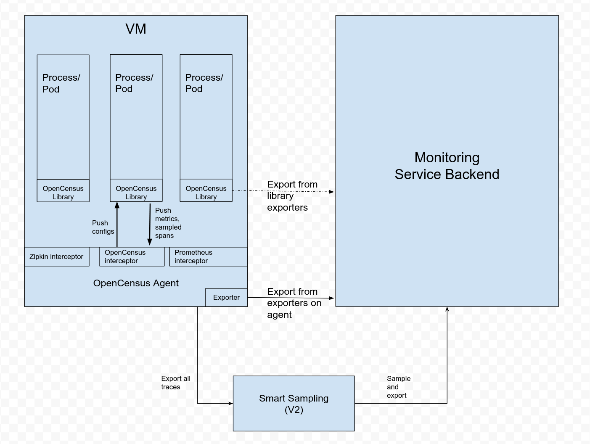

# OpenCensus Agent Proto

This package describes the OpenCensus Agent protocol.

## Architecture Overview

TODO(songya): move this section to the README under agent/service repo.

On a typical VM/container, there are user applications running in some processes/pods with
OpenCensus Library (Library). Previously, Library did all the recording, collecting, sampling and
aggregation on spans/stats/metrics, and exported them to other persistent storage backends via the
Library exporters, or displayed them on local zpages. This pattern has several drawbacks, for
example:

1. For each OpenCensus Library, exporters/zpages need to be re-implemented in native languages.
2. In some programming languages (e.g Ruby, PHP), it is difficult to do the stats aggregation in
process.
3. To enable exporting OpenCensus spans/stats/metrics, application users need to manually add
library exporters and redeploy their binaries. This is especially difficult when there’s already
an incident and users want to use OpenCensus to investigate what’s going on right away.
4. Application users need to take the responsibility in configuring and initializing exporters.
This is error-prone (e.g they may not set up the correct credentials\monitored resources), and
users may be reluctant to “pollute” their code with OpenCensus.

To resolve the issues above, we are introducing OpenCensus Agent (Agent). Agent runs as a daemon
in the VM/container and can be deployed independent of Library. Once Agent is deployed and
running, it should be able to retrieve spans/stats/metrics from Library, export them to other
backends. We MAY also give Agent the ability to push configurations (e.g sampling probability) to
Library. For those languages that cannot do stats aggregation in process, they should also be
able to send raw measurements and have Agent do the aggregation. In addition, Agent can be
extended to accept spans/stats/metrics from other tracing/monitoring libraries, such as Zipkin,
Prometheus, etc.

To support Agent, Library should have “agent exporters”, similar to the existing exporters to
other backends. There should be 3 separate agent exporters for tracing/stats/metrics
respectively. Agent exporters will be responsible for sending spans/stats/metrics and (possibly)
receiving configuration updates from Agent.

Communication between Library and Agent should user a bi-directional gRPC stream. Library should
initiate the connection, since there’s only one dedicated port for Agent, while there could be
multiple processes with Library running.

## Protocol Workflow

1. Library will try to directly establish connections for Config and Export streams.
2. As the first message in each stream, Library must sent its identifier. Each identifier should
uniquely identify Library within the VM/container. Identifier is no longer needed once the streams
are established.
3. If streams were disconnected and retries failed, the Library identifier would be considered
expired on Agent side. Library needs to start a new connection with a unique identifier
(MAY be different than the previous one).

## Packages

1. `common` package contains the common messages shared between different services, such as
`Node`, `Service` and `Library` identifiers.
2. `trace` package contains the Trace Service protos.
3. (Coming soon) `stats` package contains the Stats Service protos.
4. (Coming soon) `metrics` package contains the Metrics Service protos.
